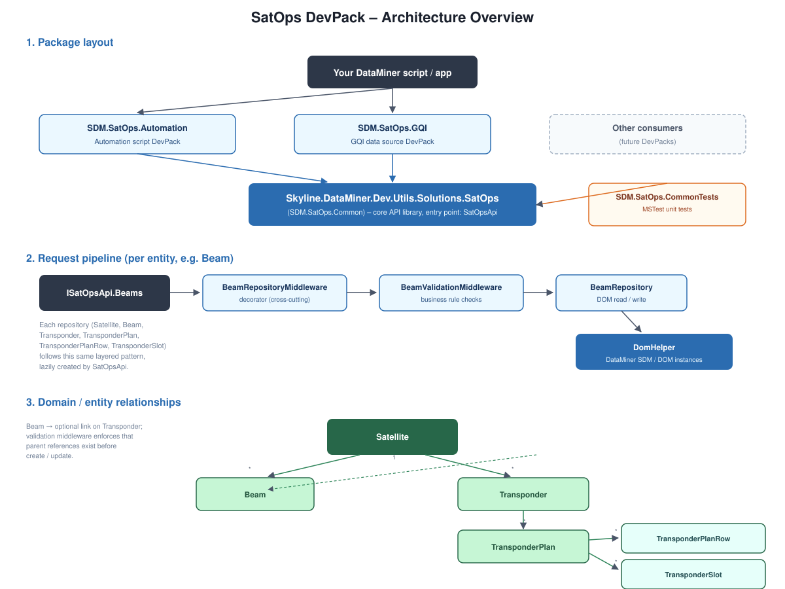

# Skyline.DataMiner.Dev.Utils.Solutions.SatOps.Common

A NuGet package providing the models, repositories and helper classes for interacting with the DataMiner SatOps (Satellite Operations) solution.

## Getting Started

> **Prerequisites:** A running DataMiner system with the [SatOps](https://catalog.dataminer.services/details/08798aa7-6c1f-42a9-bdd2-4b3d8b4afea1) solution installed.

`SatOpsApi` is the single entry point of this library. Give it a DataMiner `IConnection` — or use the `GetSatOpsApi()` extension method — and it exposes one repository per satellite-operations entity (`Satellites`, `Beams`, `Transponders`, `TransponderPlans`, `TransponderPlanRows`, `TransponderRangeReservations`, `TransponderSlots`), each created lazily on first use.

**Create the API and verify the solution is installed:**

```csharp
using Skyline.DataMiner.Solutions.SatOps.Common.API;
using Skyline.DataMiner.Solutions.SatOps.Common.API.Extensions;

var api = connection.GetSatOpsApi(); // equivalent to new SatOpsApi(connection)

if (!api.IsInstalled(out var version))
{
    throw new InvalidOperationException("The SatOps solution is not installed on this DMS.");
}
```

**Read entities:**

```csharp
var allSatellites = api.Satellites.Read();
var satellite = api.Satellites.Read(satelliteId);
var count = api.Transponders.Count();
```

**Filter with exposers:**

```csharp
using Skyline.DataMiner.Solutions.SatOps.Common.API.Querying.Transponder;

var kuBandTransponders = api.Transponders.Read(
    TransponderExposers.TransponderBand.Equal(TransponderBandType.Ku));

var wideSlots = api.TransponderSlots.Read(
    TransponderSlotExposers.Bandwidth.GreaterThan(36.0));
```

**Create an entity:**

Every repository exposes `Initialize()` to obtain a new, correctly backed instance. Fill in the properties and pass it to `Create`.

```csharp
var satellite = api.Satellites.Initialize();
satellite.Name = "Astra 1N";
satellite.Abbreviation = "A1N";
satellite.Orbit = OrbitType.GEO;
satellite.LongitudeForGEODegrees = 28.2;
satellite.Hemisphere = HemisphereType.Eastern;

satellite = api.Satellites.Create(satellite);
```

**Update, activate/deprecate and delete:**

```csharp
satellite.Operator = "SES";
api.Satellites.Update(satellite);

api.Satellites.Activate(satellite);    // Draft   -> Active
api.Satellites.Deprecate(satellite);   // Active  -> Deprecated
api.Satellites.Reactivate(satellite);  // Deprecated -> Active

api.Satellites.Delete(satellite.Id);
```

**Navigate the entity hierarchy:**

A `Satellite` owns `Beam`s and `Transponder`s, a `Transponder` owns `TransponderPlan`s, and a `TransponderPlan` owns `TransponderPlanRow`s and `TransponderSlot`s.

```csharp
var transponders = api.Transponders.ReadBySatellite(satellite.Id);
var plans = api.TransponderPlans.ReadByTransponder(transponder.Id);
var slots = api.TransponderSlots.ReadByTransponderPlan(plan.Id);
```

**Generate slots from a transponder plan:**

```csharp
var generatedSlots = api.TransponderSlots.GenerateSlots(plan);
```

**Work with range reservations:**

```csharp
var reservations = api.TransponderRangeReservations.ReadByTransponderAndTimeWindow(
    transponder.Id,
    DateTime.UtcNow,
    DateTime.UtcNow.AddDays(7));

api.TransponderRangeReservations.ReserveRange(reservation.Id, startFrequency: 10.0, endFrequency: 12.0);
```

**Enable logging (optional):**

Provide an `ILogger` implementation to surface diagnostics from the middleware pipeline.

```csharp
api.SetLogger(myLogger);
```

## About

Core API library of the SatOps DevPack solution. It contains the domain models, repositories, querying exposers and validation middleware used by the SatOps Automation, GQI and Protocol DevPacks.

### About DataMiner

DataMiner is a transformational platform that provides vendor-independent control and monitoring of devices and services. Out of the box and by design, it addresses key challenges such as security, complexity, multi-cloud, and much more. It has a pronounced open architecture and powerful capabilities enabling users to evolve easily and continuously.

The foundation of DataMiner is its powerful and versatile data acquisition and control layer. With DataMiner, there are no restrictions to what data users can access. Data sources may reside on premises, in the cloud, or in a hybrid setup.

A unique catalog of 7000+ connectors already exists. In addition, you can leverage DataMiner Development Packages to build your own connectors (also known as "protocols" or "drivers").

> **Note**
> See also: [About DataMiner](https://aka.dataminer.services/about-dataminer).

### About Skyline Communications

At Skyline Communications, we deal in world-class solutions that are deployed by leading companies around the globe. Check out [our proven track record](https://aka.dataminer.services/about-skyline) and see how we make our customers' lives easier by empowering them to take their operations to the next level.

## Architecture

The `SDM.SatOps.GQI`, `SDM.SatOps.Automation` and `SatOps.Protocol` packages are thin DevPacks that build on top of this core library rather than talking to DOM directly: automation scripts consume `SDM.SatOps.Automation`, low-code apps/dashboards consume `SDM.SatOps.GQI` as a data source, and connectors consume `SatOps.Protocol`. `SDM.SatOps.CommonTests` provides MSTest coverage for the core library.



Every repository is built as a small pipeline: the public interface (e.g. `IBeamRepository`) is implemented by a repository-specific **decorator middleware** (e.g. `BeamRepositoryMiddleware`), which optionally forwards the call to a **validation middleware** (e.g. `BeamValidationMiddleware`) before reaching the actual **repository** (e.g. `BeamRepository`) that talks to DataMiner DOM instances through `DomHelper`. This keeps validation/business rules decoupled from persistence, and lets new cross-cutting behavior be added without touching the storage code.

The domain entities also form a hierarchy: a `Satellite` owns `Beam`s and `Transponder`s, a `Transponder` owns `TransponderPlan`s, and each `TransponderPlan` owns `TransponderPlanRow`s and `TransponderSlot`s. Validation middleware enforces that these parent references exist before a child entity can be created or updated.

The core library also depends on `Skyline.DataMiner.Dev.Utils.Solutions.MediaOps.Plan`: a SatOps `Transponder` is also represented as a `Resource` in the MediaOps data model, so `TransponderResourceCreationMiddleware` keeps a matching MediaOps resource in sync whenever a transponder is created or updated.
